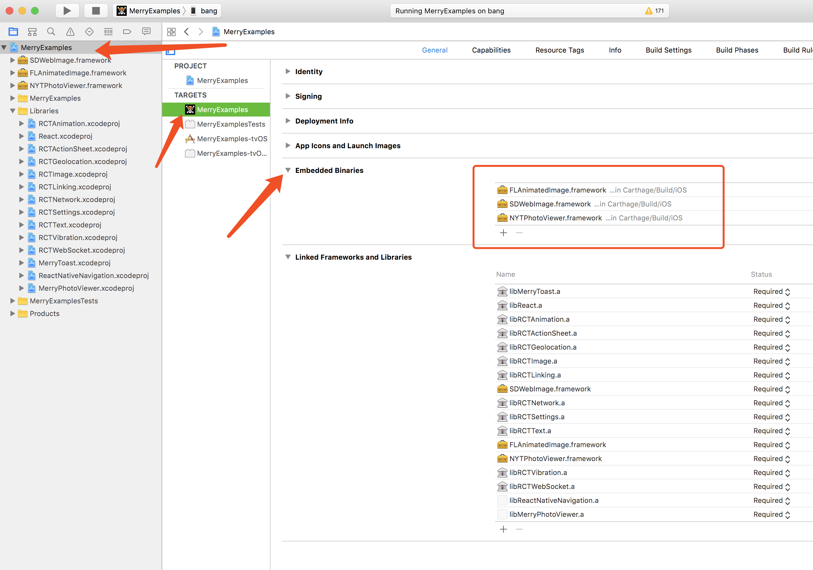

# @merryjs/photo-viewer[WIP]

> A photo viewer for react native build on top of NYTPhotoViewer and
- [@merryjs/photo-viewer[WIP]](#merryjs-photo-viewer-wip)
    - [Getting started](#getting-started)
        - [Mostly automatic installation](#mostly-automatic-installation)
        - [Manual installation](#manual-installation)
            - [iOS](#ios)
            - [IOS Link Frameworks](#ios-link-frameworks)
                - [Manual link](#manual-link)
                - [[CocoaPods](https://cocoapods.org/)](#cocoapods-https-cocoapods-org)
                - [[Carthage](https://github.com/Carthage/Carthage)](#carthage-https-github-com-carthage-carthage)
            - [Android](#android)
            - [Android targetSdkVersion configuration](#android-targetsdkversion-configuration)
            - [Android Fresco initialize](#android-fresco-initialize)
    - [Usage](#usage)
    - [LICENSE](#license)


## Getting started

`$ npm install @merryjs/photo-viewer --save`

or

`$ yarn add  @merryjs/photo-viewer`

### Mostly automatic installation

`$ react-native link @merryjs/photo-viewer`

When you done this you still need link some frameworks into your xcode's embedded framework section,
here you have some choices please see [IOS link frameworks](#ios-link-frameworks) for more details

and initialize Fresco Library please see [Android Fresco initialize](#android-fresco-initialize)

### Manual installation


#### iOS

1. In XCode, in the project navigator, right click `Libraries` ➜ `Add Files to [your project's name]`
2. Go to `node_modules` ➜ `@merryjs/photo-viewer` and add `MerryPhotoViewer.xcodeproj`
3. In XCode, in the project navigator, select your project. Add `libMerryPhotoViewer.a` to your project's `Build Phases` ➜ `Link Binary With Libraries`
4. Run your project (`Cmd+R`)<

#### IOS Link Frameworks

##### Manual link

For some reasons if you dont want use any package manager in your side then you can link frameworks as:

- Go to your xcode project choose your project if you unsure it click (command + 1)
- Choose target General panel find embedded binaries click + icon will display a dialog and then go to `node_modules/@merryjs/photo-viewer/ios/Carthage/Build/iOS/` folder add these frameworks into your xcode project. It should looks like below
	

##### [CocoaPods](https://cocoapods.org/)

TODO: If you want use CocoaPods you can go to these repo find out how to integrated with cocoapods, i have not try this in the example repo

##### [Carthage](https://github.com/Carthage/Carthage)

If you want use Carthage in your project and then you can add these dependencies into your Cartfile

```

github "NYTimes/NYTPhotoViewer" "develop"
github "rs/SDWebImage"

```
and run `carthage update` when you done this you can link it like Manual link from node_modules describes, the only difference is use your carthage file instead of ours

#### Android

1. Open up `android/app/src/main/java/[...]/MainActivity.java`
  - Add `import com.merryjs.PhotoViewer.MerryPhotoViewerPackage;` to the imports at the top of the file
  - Add `new MerryPhotoViewerPackage()` to the list returned by the `getPackages()` method
2. Append the following lines to `android/settings.gradle`:
  	```
  	include ':@merryjs/photo-viewer'
  	project(':@merryjs/photo-viewer').projectDir = new File(rootProject.projectDir, 	'../node_modules/@merryjs/photo-viewer/android')
  	```
3. Insert the following lines inside the dependencies block in `android/app/build.gradle`:
  	```
      compile project(':@merryjs/photo-viewer')
  	```
#### Android targetSdkVersion configuration

We use a third part library and both of them are target to `targetSdkVersion 25`, so you need update your build.gradle to the same version or you will meet a build error

The configuration looks like: (`android/app/build.gradle`)

```java

android {
    compileSdkVersion 25
    buildToolsVersion "25.0.3"

    defaultConfig {
        applicationId "com.merryexamples"
        minSdkVersion 16
        targetSdkVersion 25
        versionCode 1
        versionName "1.0"
        ndk {
            abiFilters "armeabi-v7a", "x86"
        }

        renderscriptTargetApi 25
        renderscriptSupportModeEnabled true
    }
	// ...
}
```

If we have any better solution will update this section in the future.

#### Android Fresco initialize

When you have linked you need one more step for initialize the Fresco Library

```java
@Override
public void onCreate() {
super.onCreate();
SoLoader.init(this, /* native exopackage */ false);
// If your picture very large you can initialize it with these configurations

//        ImagePipelineConfig config = ImagePipelineConfig.newBuilder(this)
//                .setProgressiveJpegConfig(new SimpleProgressiveJpegConfig())
//                .setResizeAndRotateEnabledForNetwork(true)
//                .setDownsampleEnabled(true)
//                .build();
//        Fresco.initialize(this, config);

Fresco.initialize(this);

}
```

Add activity to `AndroidManifest.xml` inside application section

```xml

<application>
	...
	<activity android:name="com.merryjs.PhotoViewer.MerryPhotoViewActivity" android:theme="@style/Theme.Transparent"/>

</application>

```

Note: if you don't want a transparent theme you can remove `android:theme="@style/Theme.Transparent"` from your activity
otherwise you need add a style resource in you android project

The full path is `android/app/res/values/styles.xml`, if the res folder doest not exist, please create one, the `styles.xml` looks like

```xml
<resources>

    <!-- Base application theme. -->
    <style name="AppTheme" parent="Theme.AppCompat.Light.NoActionBar">
        <!-- Customize your theme here. -->
    </style>

	<!-- Photo Viewer Transparent Theme  -->
    <style name="Theme.Transparent" parent="AppTheme">
        <item name="android:windowIsTranslucent">true</item>
        <item name="android:windowBackground">@android:color/transparent</item>
        <item name="android:windowContentOverlay">@null</item>
        <item name="android:windowNoTitle">true</item>
        <item name="android:windowIsFloating">true</item>
        <item name="android:backgroundDimEnabled">false</item>
    </style>

</resources>


```

Thats all.


## Usage

The most part from this package is setup the Native side dependencies, once you have done it before,
you can use it as below, very very easy to use:

```javascript

import photoViewer from '@merryjs/photo-viewer';

photoViewer.show(options) // Promise

```

At this moment, only two methods you need to call
- `show` for display the photo viewer
- `hide` for hide the photo viewer, but most case you just need `show` it.

For more info please [see the js file](https://github.com/merryjs/photo-viewer/blob/master/index.js), its very simple, and if you use `TypeScript` you can have a good type definition and no need any setup.

All options list below `index.d.ts`

```ts
/**
 * Photo data
 */
export interface Photo {
    url: string;
    title?: string;
    summary?: string;
    titleColor?: string | number;
    summaryColor?: string | number;
}
export interface PhotoViewerOptions {
    /**
       * Pictures for view
       */
    data: Photo[];
    /**
       * Start position
       */
    initial: number;
    /**
       * Set overlay background color
       */
    backgroundColor?: string;
    /**
       * Hide status bar
       */
    hideStatusBar: boolean;
    /**
       * Android only
       */
    swipeToDismiss?: boolean;
    /**
       * Android only
       */
    zooming?: boolean;
    /**
       * Android only
       * Set share text the default text is SHARE
       */
    shareText?: string;
    /**
     * Android only
     * Share text color
     */
    shareTextColor?: string;
    /**
     * Android only
     * 1 / 2 Page text color
     */
    titlePagerColor?: string;
}
/**
 * Photo viewer
 */
declare const photoViewer: {
    show(options: PhotoViewerOptions): Promise<void>;
    hide(): void;
};
export default photoViewer;

```

## LICENSE

```

Copyright 2017 Merryjs.com

Licensed under the Apache License, Version 2.0 (the "License");
you may not use this file except in compliance with the License.
You may obtain a copy of the License at

	http://www.apache.org/licenses/LICENSE-2.0

Unless required by applicable law or agreed to in writing, software
distributed under the License is distributed on an "AS IS" BASIS,
WITHOUT WARRANTIES OR CONDITIONS OF ANY KIND, either express or implied.
See the License for the specific language governing permissions and
limitations under the License.

```


Due to we use some third-part softwares and both of them are licensed under Apache 2.0 so do we.

- [Photo Viewer](https://github.com/merryjs/photo-viewer/blob/master/LICENSE)
- [NYTPhotoViewer](https://github.com/NYTimes/NYTPhotoViewer/blob/develop/LICENSE.md)
- [FrescoImageViewer](https://github.com/stfalcon-studio/FrescoImageViewer#license)
